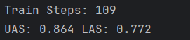

<h1 align="center"> Neural Dependency Parser</h1>

An improved neural scorer for dependency parsing based on the Maximum Spanning Tree algorithm.

The model is trained and evaluated on the <a href="https://github.com/UniversalDependencies/UD_Bulgarian-BTB">
Bulgarian-BTB dataset.</a>

Compared to the simpler count based model from previous work, which got :

1. **UAS = 0.80**
2. **LAS = 0.73**

this neural approach to the bulgarian dataset significantly improves the scores after training for 109 iterations on a
T4 GPU.

1. **UAS = 0.86**
2. **LAS = 0.77**

<h2>The Model</h2>
The following section is meant as a quick overview of the used architecture. At first, pretrained <em>Word2Vec</em> embeddings for words and tags are built. These are to freeze the initial embedding layer of the network and as a couple of papers mention, it often
proves more useful to start learning with already initialized embeddings than to build them from scratch. For each input sequence, I get the word and tag embedding, as well as the character + morphological features embeddings. They are learnt with a **uni directional LSTM**. Out of vocabulary tags, labels and characters are not expected,
however for OOV words a special **UNK** token is used.

All the discussed features above are concatenated to form the input to the three layers of **Bi-LSTM** units, which would give us a hidden vector representing the information encoded in the sequence. This hidden vector, for short **h** serves as input to 4 different **MLP** classifiers. The first two classifiers are representation of the word as a possible head/dependent, the latter two model the label from the possible head/dependent.
Applying linear transformation we achieve the desired dimensionality which I call the adjacency matrix. Each row index represents a current word and each column the probability for its head. To get the label predictions, additional **MLP** classifier is used to again get the desired dimensions, where each column is representing probability for the label. 

The learning happens by iterating over all sentences and giving predictions at each one. The two separate cross entropy loss functions (for arcs and labels) are summed and then minimized. The gradient descent algorithm used during training is Adam with parameters:

1. learning rate = 0.002
2. betas = (0.9, 0.9)
3. weight_decay = 1e-6

During test time, graph-based approach is used to ensure elimination of existing cycles. The sentence is represented as a Directed Graph, the arcs and their labels have weights. Now the problem is simply finding the Maximum Spanning Tree which guarantees the best parse according to our model. 

<h2>Usage</h2>

The usage is extremely simple, after cloning the repo locally one can just write `python mst.py` in the terminal to
reproduce the scores.

Example:

